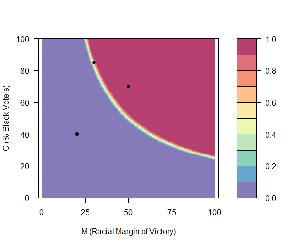
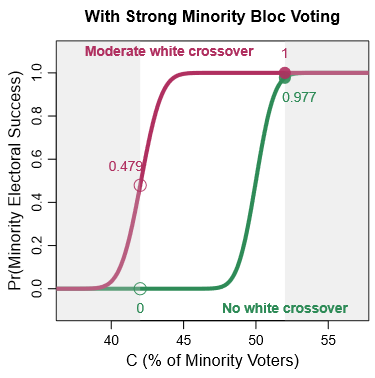

# logical: Computing and Visualizing Quantitative Predictions of Logical Models

[](https://github.com/YukiAtsusaka/cWise)
[](https://cran.r-project.org/package=cWise)
[](https://www.gnu.org/licenses/gpl-3.0.en.html) 

This R package computes and visualizes the quantitative predictions of the logical model of minority representation introduced by Atsusaka (2021) ["A Logical Model for Predicting Minority Representation: Application to Redistricting and Voting Rights Cases"](https://papers.ssrn.com/sol3/papers.cfm?abstract_id=3637699) (Conditionally Accepted by the *American Political Science Review*).


## Main Idea
The logical model of minority representation states that the probability that a minority candidate runs for office is equal to the probability that the minority candidate wins the race, which in turn is a Cumulative Distribution Function (CDF) of the standard normal distribution of a square-root of a product of two terms (MC) minus 50.

Semi-formally, **Pr(Minority Runs) = Pr(Minority Wins) = &Phi;( &Sqrt;(MC)- 50)**, where

- **C** : % minority voters in the electorate
- **M** : (adjusted) racial margin of victory
    = (V<sub>t-1</sub><sup>M</sup> - V<sub>t-1</sub><sup>W</sup>) + 50
    + **V<sub>t-1</sub><sup>M</sup>** : the vote share of the "top" (most vote-earning) minority candidate in the most recent election (at time "t-1")
    + **V<sub>t-1</sub><sup>W</sup>** : the vote share of the "top" (most vote-earning) white candidate in the most recent election (at time "t-1")
    + M represents the past performance of minority candidates relative to their white counterparts
    + M quantifies how safely minority candidates secure their descriptive representation relative to their white counterparts

## Key Applications

The logical model can answer various questions that researchers and practicioners are often interested in redistricting and voting rights cases, including:

- *Do minority voters have a viable chance of electing their candidate of choice in about 25\% minority (*influence*) districts?* 
- *Does changing the percentage of minority voters from A (less than 50) to B (over 50) significantly increases the probability that minority candidates emerge?* 
- *What percentage of minority voters is sufficient for a given district to enable minority voters to elect their co-ethnic candidates?*
- *Where is the "sweet spot" -- the point at which the probability of minority candidates becomes high enough with the minimum percentage of minority voters?* 
- *Does a given district plan have more minority voters than necessary to elect minority candidates, leading to a potential vote dilution?* 
- *How many minority representatives are likely to be elected under a given district plan?*


This README file explains how to apply the logical model to answer these questions in specific contexts via this R package. It also documents multiple motivating examples from actual redistricting and voting rights cases.


<br/>

<details>
<summary>Cite this software✒️</summary>

@Manual{,
    title = {logical: A Software to Compute and Visualize Quantitative Predictions of Logical Models},
    author = {Yuki Atsusaka},
    year = {2020},
    note = {R package version 0.0.0},
    url = {https://CRAN.R-project.org/package=logical},
  }
</details>

This R package is still under development. Please let me know ([atsusaka@rice.edu](atsusaka@rice.edu)) if you find any issue installing and using the software..!


<br/>

## Instllation
To install the latest development version of `logical` directly from
[GitHub](https://github.com/YukiAtsusaka/logical) use:

``` r
library(devtools)
devtools::install_github("YukiAtsusaka/logical")
```


## Loading

First, load the package.

``` r
library(logical)

# This package contains several functions and sample data

# minorep (prediction tool)
# redistrict (prediction tool)
# plot.minorep (visulization tool)
# plot.redistrict (visulization tool)
# statelegis (sample data)
```

Below, I explain how to use this package by questions that it can answer, instead of introducing the funcationality by functions.

<br/>

## 1. Predicting the Probability of Minority Electoral Success
### Key functions: `minorep`,  `plot.minorep` 

`minorep` is a workhorse function of this package. It predicts a probability at which minority candidates run for office and win races in districts with specified values of *M* and *C*. For example, when one wants to predict the probability of minority candidate emergence and electoral success (equivalent in the logical model) for three districts for which she knows the percentage of minority voters and the (adjusted) racial margin of victory:

```r
rmargin <- c(20, 50, 30)   # Half the Difference between the Top Minority and Top White Vote Shares
VAP <- c(40, 70, 85)       # Minority Voting-Age Population
rep.prob <- minorep(M=rmargin, C=VAP)
rep.prob
# [1] 0.9982217 1.0000000 1.0000000
```
<br/>

> ### Motivating Examples (1): Influence Districts in *Hayes v. Louisiana* (1992)
> In *Heyes v. Louisiana* (1992), one of the main controversies was about the empirical validity of the claim that minority voters can influence electoral results (to elect minority candidates) in districts with about 20% minority voters. While the plaintiffs maintained that such districts can be minority *influence* districts, the state contended that "there was no evidence" to support such a theory given a strong racially polarized voting pattern (Enstrgom and Kirksey 1998, 250). The logical model offers one answer to this debate: the probability of minority candidate emergence in districts with 20% minority voters with a strong racially polarized voting pattern is almost 0. Other claims have been that 35% to 45% (*Heyes v. Louisiana* (1994))(Enstrgom and Kirksey 1998, 258) minority voters are sufficient to provide minority voters with a realistic chance to elect a candidate of their choice.

<br/>

```r
plot.minorep(M=margin, C=VAP)
```


<br/>

## 2. Simulating the Impact of Redistricting on Minority Representation
### Key functions: `redistrict`,  `plot.redistrict` 

Generate a probability of minority candidate emergence with specified levels of minority co-ethnic voting and White crossover voting as follows:

```r
# Suppose we have two district plans for which we know the expected behaviors of minority and white voters 
# (from surveys, exit polls, ecological inference, historical analyses, etc)

# Plan1 
# 90% of minority voters are expected to vote for the minority candidate (Strong Minority Bloc Voting)
# 0% of white voters are expected to vote for the minority candidate (No White Crossover)

# Plan2
# 90% of minority voters are expected to vote for the minority candidate (Strong Minority Bloc Voting)
# 30% of white voters are expected to vote for the minority candidate (Moderate White Crossover)

plan1 <- redistrict(coethnic=0.9, crossover=0)  
plan2 <- redistrict(coethnic=0.9, crossover=0.3) 
```

<br/>


```r
myplans = cbind(plan1, plan2)
myrange = c(44,55) # From 44% to 55%
plot.redistrict(plans=myplans, range=myrange)

# To Add Title, etc.
text(x=start, y=1.1, labels="Moderate white crossover",
      cex=1, col="maroon", font=2)
text(x=start+10, y=-0.09, labels="No white crossover",
     cex=1, col="seagreen", font=2)
 title("With Strong Minority Bloc Voting")
```




<br/>

## 3. Finding Sufficient Percentage of Minority Voters and Sweet Spot
### Key functions: `redistrict`,  `plot.redistrict` 

Users can pre-specified a threshold as a probability of minority electoal success under given district plans. For example, one may be interested what percentage of minority voters is sufficient to yield 80% or higher chance of having a minority officeholder under two different plans (from the above examples). Under this option, a probability (from 0 to 1) must be input for the optional argument "threshold" as follows:

```r
myplans = cbind(plan1, plan2)                  # Same Plans from Above
plot.redistrict(plans=myplans, threshold=0.8)  # Setting 0.8 as a threshold value

# To Add Title, etc.
text(x=start, y=1.1, labels="Moderate white crossover",
      cex=1, col="maroon", font=2)
text(x=start+10, y=-0.09, labels="No white crossover",
     cex=1, col="seagreen", font=2)
title("With Strong Minority Bloc Voting")
```

<br/>


<br/>

## 4. Quantifying the Degree of Vote Dilution via Packing
### Key functions: `redistrict`,  `plot.redistrict` 

Building upon (2), one can also visualize the degree of potential vote dilution via "packing" of minority voters. For this option, one only needs to input a percentage point as an additional argument "C". Suppose that a district plan that one examines have 75% minority voters and she wants to know how many minority voters the district has beyond what is sufficient to elect a minority candidate with a probability of 0.8 and higher.

```r

myplans = cbind(plan1, plan2)                  # Same Plans from Above
plot.redistrict(plans=myplans, 
                threshold=0.8,                 # Setting 0.8 as a threshold value
                C=75)                          # A plan has 75% minority voters

# To Add Title, etc.
text(x=start, y=1.1, labels="Moderate white crossover",
      cex=1, col="maroon", font=2)
text(x=start+10, y=-0.09, labels="No white crossover",
     cex=1, col="seagreen", font=2)
title("With Strong Minority Bloc Voting")


```

<br/>

## 5. Predicting the Number of Minority Officeholders
### Key functions: `minorep`,  `n.minorep` 

<br/>


## 6. Using Complex Options
### Key functions: `redistrict` 

#### Extention I (Accounting for the Turnout Gap)
As an extension, one can also account for the relative turnout rates for minority and white voters, if any. To account for the turnout gap in simulating *M*, one can simply include a vector of proportions of minority and white voters who turn out as an additional argument. Suppose that one knows that, from exit polls, surveys, ecological inference, and/or historical studies, turnout rates are usually 0.5 for minority voters and 0.6 for white voters.

```r
# Suppose we know/estimate that:
# 90% of minority voters are expected to vote for the minority candidate
# 30% of white voters are expected to vote for the minority candidate
# Turnout Rates are 50% (minority voters) and 60% (white voters)

plan3 <- redistrict(coethnic=0.9, crossover=0.3, gap=c(0.5, 0.6))
```


<br/>

> ### Motivating Example (3): Louisiana Congressional District 4 Plan in 1992
> Concerning the effectiveness of the plan for a new majority-minority District 4 supported by the Senate in the 1990 round of redistricting, "Sherman Copelin, the African-American representative who sponsored the [alternative] plan, complained that the new minority district in the plan passed by the Senate did not contain enough African-American voters to ensure that African-Americans would elect a candidate of their choice....The percentage of African-Americans among the registered voters in this district was 63.2, almost 4 percentage points higher than the second minority district in the other version" (Engstrom and Kirksey 1998, 245)

<br/>


