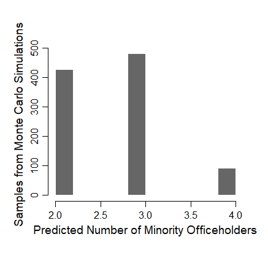

# logical: Computing and Visualizing Quantitative Predictions of Logical Models

[](https://github.com/YukiAtsusaka/cWise)
[](https://cran.r-project.org/package=cWise)
[](https://www.gnu.org/licenses/gpl-3.0.en.html) 

**This R package is for computing and visualizing the quantitative predictions of a logical model of minority representation.** This quantitatively predictive logical model was developed in Atsusaka (2021) ["A Logical Model for Predicting Minority Representation: Application to Redistricting and Voting Rights Cases"](https://papers.ssrn.com/sol3/papers.cfm?abstract_id=3637699) (Conditionally Accepted by the *American Political Science Review*).


<br/>

For quantitatively predictive logical models more generally, please do check out:

- Taagepera, Rein. 2007. [*Predicting Party Sizes: The Logic of Simple Electoral Systems*](https://books.google.com/books?id=T_YTDAAAQBAJ&printsec=frontcover&dq=rein+taagepera&hl=ja&sa=X&ved=2ahUKEwjslpOhndnwAhURac0KHdMWD0AQ6AEwBHoECAUQAg#v=onepage&q=rein%20taagepera&f=false). Oxford University Press.
- Taagepera, Rein. 2008. [*Making Social Sciences More Scientific: The Need for Predictive Models*](https://books.google.com/books?id=l6tiJLcVZ8AC&printsec=frontcover&dq=rein+taagepera&hl=ja&sa=X&ved=2ahUKEwjslpOhndnwAhURac0KHdMWD0AQ6AEwBnoECAcQAg#v=onepage&q=rein%20taagepera&f=false). Oxford University Press.
- Shugart, Matthew S and Rein Taagepera. 2017. [*Votes from seats: Logical models of electoral systems*](https://books.google.com/books?id=0S42DwAAQBAJ&printsec=frontcover&dq=rein+taagepera&hl=ja&sa=X&ved=2ahUKEwjslpOhndnwAhURac0KHdMWD0AQ6AEwCHoECAsQAg#v=onepage&q=rein%20taagepera&f=false). Cambridge University Press.

<br/>

This R package is still under development. Please let me know ([atsusaka@rice.edu](atsusaka@rice.edu)) if you find any issue installing and using the software! **I am looking for a partner who can co-manage this R package with me. If you are interested in and have prior experience in managing R packages, please let me know!**

<details>
<summary>How to Cite logical✒️</summary>

@Manual{,
    title = {logical: A Software to Compute and Visualize Quantitative Predictions of Logical Models},
    author = {Yuki Atsusaka},
    year = {2021},
    note = {R package version 0.0.1},
    url = {https://CRAN.R-project.org/package=logical},
  }
</details>

## Core Idea
The logical model of minority representation states that the probability that a minority candidate runs for office is equal to the estimated probability that the minority candidate wins the race. This estimated probability in turn is the standard normal CDF (Cumulative Distribution Function) of a square-root of a product of two terms (MC) minus 50.

Semi-formally, **Pr(Minority Runs) = Pr(Minority Wins) = &Phi;( &Sqrt;(MC)- 50)**, 

where

- **C** : % minority voters in the electorate
    + C represents the racial margin of victory (see below) in the presence of extreme racial polarization
- **M** : (adjusted) racial margin of victory
    = (V<sub>t-1</sub><sup>M</sup> - V<sub>t-1</sub><sup>W</sup>) + 50
    + **V<sub>t-1</sub><sup>M</sup>** : the vote share of the "top" (most vote-earning) minority candidate in the most recent election (at time "t-1")
    + **V<sub>t-1</sub><sup>W</sup>** : the vote share of the "top" (most vote-earning) white candidate in the most recent election (at time "t-1")
    + M represents the past performance of minority candidates relative to their white counterparts
    + M quantifies how safely minority candidates secure their descriptive representation relative to their white counterparts


## Key Applications

The logical model can answer various questions that researchers and practicioners are often interested in redistricting and voting rights cases, including:

- *Do minority voters have a viable chance of electing their candidate of choice in about 25\% minority (*influence*) districts?* 
- *Does changing the percentage of minority voters from A (less than 50) to B (over 50) significantly increases the probability that minority candidates emerge?* 
- *What percentage of minority voters is sufficient for a given district to enable minority voters to elect their co-ethnic candidates?*
- *Where is the "sweet spot" -- the point at which the probability of minority candidates becomes high enough with the minimum percentage of minority voters?* 
- *Does a given district plan have more minority voters than necessary to elect minority candidates, leading to a potential vote dilution?* 
- *How many minority representatives are likely to be elected under a given district plan?*


**This README file explains how to apply the logical model to answer these questions in specific contexts via this R package.** 

<br>

## Instllation
To install the latest development version of `logical` directly from
[GitHub](https://github.com/YukiAtsusaka/logical) use:

``` r
library(devtools)
devtools::install_github("YukiAtsusaka/logical")

# This may take some time. 
# Also, you may be asked to update 
# one or more packages if you are not using
# the most recent version of R.
```

## Loading

First, load the package.

``` r
library(logical)

# This package contains several functions and sample data
# Main Functions
# minorep (prediction tool)
# n_minorep (prediction tool)
# sim_redistrict (prediction tool)

# Help Functions
# comp_M (computing tool)
# sim_M (computing tool)
```

Below, I explain how to use this package by questions that it can answer, instead of introducing the funcationality by functions.

<br/>

## 1. Predicting the Probability of Minority Electoral Success
#### :key: `minorep`,  `plot_minorep` 

`minorep` is a workhorse function of this package. It predicts a probability at which minority candidates run for office and win races in districts with specified values of *M* and *C*. For example, when one wants to predict the probability of minority candidate emergence and electoral success (equivalent in the logical model) for three districts for which she knows the percentage of minority voters and the (adjusted) racial margin of victory:

```r
# Base Implementation
M_vec <- c(20, 50, 30)   # Half the Difference between the Top Minority and Top White Vote Shares
C_vec <- c(40, 70, 85)   # % minority voters (e.g., CVAP, VAP, Population)
pred <- minorep(M=M_vec, C=C_vec)
pred
# [1] 0.000 1.000 0.691

# Accounting for Turnout Grap
pred_gap <- minorep(M=M_vec, C=C_vec, gap=c(0.5,0.6)) # 50% of minority and 60% of white voters turn out 
pred_gap
# [1] 0.0000 1.0000 0.4039
```
<br/>


```r
plot_minorep(M=margin, C=VAP)
```


<br/>

## 2. Predicting the Number of Minority Officeholders
#### :key: `minorep`,  `plot_minorep`  

Sometimes researchers are interested in predicting the number of minority officeholders at the jurisdiction level. For example, researchers may wish to know how many minority representatives can be expected in an entire jurisdiction with six districts, where they observe a set of information: **C**=(50,40,60,30,50,80) and **M**=(50,40,40,35,70,85).


```r
M_vec <- c(50,40,40,35,70,85)                 # M from the six districts 
C_vec <- c(50,40,60,30,50,80)                 # C from the six districts

pred_vec <- minorep(M=M_vec, C=C_vec)         # Obtain model predictions

n_pred <- n_minorep(model_predict = pred_vec) # Draw the number of minority winners via Monte Carlo simulations
hist(n_pred)                                  # Visualize the results in histogram
```



<br/>

## 3. Computing or Simulating the Racial Margin of Victory
#### :key: `comp_M`,  `sim_M`  

So far, we have assumed that *M* is readily available. However, researchers often want to (A) compute the racial margin of victory based on observed data or (B) simulate it using substantive knowledge on the level of minority bloc voting and white crossover. Two help functions will help you achieve each of these goals:

```r
# Computing M from observed data
top_minority <- c(18, 40, 85, 20) # Top minority candidate's vote share in four districts
top_white <- c(60, 40, 10, 34)    # Top white candidate's vote share in four districts

M_vec_obs <- comp_M(Vm = top_minority, Vw = top_white) # Compute the (adjusted) racial margin of victory
M_vec_obs
# [1] 29.0 50.0 87.5 43.0

# Simulating M from substantive knowledge
C_hypothetical <- c(40,50,60)  # Hypothetical percentages of % minority voters
bloc <- 1        # Proportion of minority voters who vote for a single (hypothetical) minority candidate
cross <- 0.3     # Proportion of white voters who vote for a single (hypothetical) minority candidate

M_vec_sim <- sim_M(C = C_hypothetical, coethnic = bloc, crossover = cross)
M_vec_sim
# [1] 58 65 72
```

<br/>

## 4. Simulating the Impact of Redistricting on Minority Representation
#### :key: `sim_redistrict`,  `plot_redistrict` 

Generate a probability of minority candidate emergence with specified levels of minority co-ethnic voting and White crossover voting as follows:

```r
# Suppose we have two district plans for which we know the expected behaviors of minority and white voters 
# (from surveys, exit polls, ecological inference, historical analyses, etc)

# Plan1 
# 90% of minority voters are expected to vote for the minority candidate (Strong Minority Bloc Voting)
# 0% of white voters are expected to vote for the minority candidate (No White Crossover)

# Plan2
# 90% of minority voters are expected to vote for the minority candidate (Strong Minority Bloc Voting)
# 30% of white voters are expected to vote for the minority candidate (Moderate White Crossover)

plan1 <- sim_redistrict(coethnic=0.9, crossover=0)  
plan2 <- sim_redistrict(coethnic=0.9, crossover=0.3) 
```

<br/>


```r
myplans = cbind(plan1, plan2)
myrange = c(44,55) # From 44% to 55%
plot_redistrict(plans=myplans, range=myrange)

# To Add Title, etc.
text(x=start, y=1.1, labels="Moderate white crossover",
      cex=1, col="maroon", font=2)
text(x=start+10, y=-0.09, labels="No white crossover",
     cex=1, col="seagreen", font=2)
title("With Strong Minority Bloc Voting")
```


<br/>

## 5. Finding Sufficient Percentage of Minority Voters, Sweet Spot, Degree of Vote Dilution via Packing
#### :key: `sim_redistrict`,  `plot_redistrict` 

Users can pre-specified a threshold as a probability of minority electoal success under given district plans. For example, one may be interested what percentage of minority voters is sufficient to yield 80% or higher chance of having a minority officeholder under two different plans (from the above examples). Under this option, a probability (from 0 to 1) must be input for the optional argument "threshold" as follows:

```r
myplans = cbind(plan1, plan2)                  # Same Plans from Above
plot_redistrict(plans=myplans, threshold=0.8)  # Setting 0.8 as a threshold value

# To Add Title, etc.
text(x=start, y=1.1, labels="Moderate white crossover",
      cex=1, col="maroon", font=2)
text(x=start+10, y=-0.09, labels="No white crossover",
     cex=1, col="seagreen", font=2)
title("With Strong Minority Bloc Voting")
```

<br/>


<br/>
