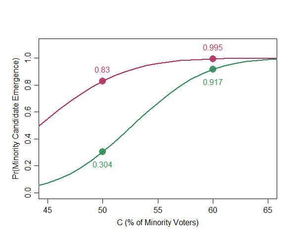

# logical: A Software to Compute and Visualize Quantitative Predictions of Logical Models

This R package computes and visualizes the quantitative predictions of the logical model of minority candidate emergence introduced by Atsusaka (2020) ["A Logical Model for Predicting Minority Representation: Application to Redistricting and Voting Rights Studies"](https://papers.ssrn.com/sol3/papers.cfm?abstract_id=3637699).

<details>
<summary>Cite this software✒️</summary>

@Manual{,
    title = {logical: A Software to Compute and Visualize Quantitative Predictions of Logical Models},
    author = {Yuki Atsusaka},
    year = {2020},
    note = {R package version 0.0.0},
    url = {https://CRAN.R-project.org/package=logical},
  }
</details>

This R package is still under development. Please let me know ([atsusaka@rice.edu](atsusaka@rice.edu)) if you find any issue installing and using the software..!


## Instllation
To install the latest development version of `logical` directly from
[GitHub](https://github.com/YukiAtsusaka/logical) use:

``` r
library(devtools)
devtools::install_github("YukiAtsusaka/logical")
```
<br>


## Example

First, load the package.

``` r
library(logical)
```

<br/>

## `minorep`: Predict the Probability of Minority Candidate Emergence and Electoral Success with Specified Values of *M* and *C*
Predict a probability at which minority candidates run for office and win races in districts with specified values of *M* and *C* as follows:

```r
rmargin <- c(20, 50, 30)   # Half the Difference between the Top Minority and Top White Vote Shares
VAP <- c(40, 70, 85)       # Minority Voting-Age Population
rep.prob <- minorep(M=rmargin, C=VAP)
rep.prob
# [1] 0.9982217 1.0000000 1.0000000
```
<br/>

### Motivating Examples (1): Influence Districts in *Hayes v. Louisiana* (1992)
In *Heyes v. Louisiana* (1992), one of the main controversies was about the empirical validity of the claim that minority voters can influence electoral results (to elect minority candidates) in districts with about 20% minority voters. While the plaintiffs maintained that such districts can be minority *influence* districts, the state contended that "there was no evidence" to support such a theory given a strong racially polarized voting pattern (Enstrgom and Kirksey 1998, 250). The logical model offers one answer to this debate: the probability of minority candidate emergence in districts with 20% minority voters with a strong racially polarized voting pattern is almost 0. Other claims have been that 35% to 45% (*Heyes v. Louisiana* (1994))(Enstrgom and Kirksey 1998, 258) minority voters are sufficient to provide minority voters with a realistic chance to elect a candidate of their choice.

<br/>

## `plot.minorep`: Visualize the Predicted Probability of Minority Representation with Input Values of  *M* and *C*

```r
plot.minorep(M=margin, C=VAP)
```


<br/>

## `redistrict`: Simulated the Probability of Minority Candidate Emergence in Varying District Racial Compositions
Generate a probability of minority candidate emergence with specified levels of minority co-ethnic voting and White crossover voting as follows:

```r
# plan1: Strong Minority Co-ethnic Voting and No White Crossover
# plan2: Strong Minority Co-ethnic Voting and Moderate White Crossover
plan1 <- redistrict(coethnic=0.9, crossover=0, sd=5)  
plan2 <- redistrict(coethnic=0.9, crossover=0.3, sd=5) 

# PLOT THE SIMULATED PROBABILITIES
start <- 45 # Starting Point
end <- 55   # Ending Point

plot(0, type="n", ylim=c(-0.1,1.1),xlim=c(start-5,end+5),
   ylab="Pr(Minority Candidate Emergence)",xlab="C (% of Minority Voters)",
   mgp=c(2,0.7,0))
lines(sim1, col="seagreen",lwd=2.5)
lines(sim2, col="maroon",lwd=2.5)
 points(x=start, y=sim1[start], pch=16, cex=2, col=scales::alpha("seagreen",0.9))
 points(x=end, y=sim1[end], pch=16, cex=2, col=scales::alpha("seagreen",0.9))
 text(x=start, y=sim1[start]-0.09, labels=round(sim1[start],d=3), col="seagreen")
 text(x=end, y=sim1[end]-0.09, labels=round(sim1[end],d=3), col="seagreen")
 points(x=start, y=sim2[start], pch=16, cex=2, col=scales::alpha("maroon", 0.9))
 points(x=end, y=sim2[end], pch=16, cex=2, col=scales::alpha("maroon", 0.9))
 text(x=start, y=sim2[start]+0.09, labels=round(sim2[start],d=3), col="maroon")
 text(x=end, y=sim2[end]+0.09, labels=round(sim2[end],d=3), col="maroon")
 text(x=start+1, y=1.08, labels="Strong minority co-ethnic voting \n + Moderate White crossover",
      cex=0.8, col="maroon", font=2)
 text(x=start+6, y=0.2, labels="Strong minority co-ethnic voting \n + No White crossover",
      cex=0.8, col="seagreen", font=2)
```



<br/>

### Motivating Example (3): Louisiana Congressional District 4 Plan in 1992

Concerning the effectiveness of the plan for a new majority-minority District 4 supported by the Senate in the 1990 round of redistricting, "Sherman Copelin, the African-American representative who sponsored the [alternative] plan, complained that the new minority district in the plan passed by the Senate did not contain enough African-American voters to ensure that African-Americans would elect a candidate of their choice....The percentage of African-Americans among the registered voters in this district was 63.2, almost 4 percentage points higher than the second minority district in the other version" (Engstrom and Kirksey 1998, 245)

<br/>


